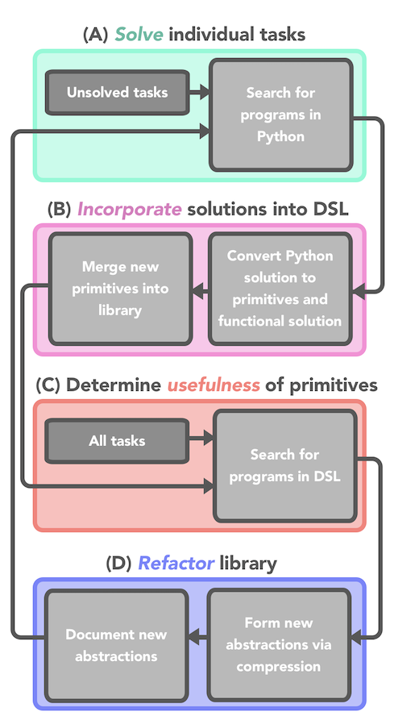

# DFL2DSL

dfl2dsl: Dead F-in Last to Domain Specific Language

Building a codebase for a specific domain that is flexible and extentable is labor-intensive and requires expertise. Can we build a system that builds a useful domain-specific language (DSL) from scratch?

In this project, we will attempt to do just this: create a system that generates a DSL using only a description of the domain and example problems.




# Overview

Our proposed system has four steps that are modeled after how a programmer might generate a DSL. Importantly, this system is a loop. As long as each iteration solves a new problem, we can continue to iterate these three steps -- improving the library.

## Step A: Solve individual tasks
First, a programmer may start by solving problems in the domain, real or imagined, without regard for the generality of their programs.

We model this by solving all unsolved tasks independently of each other, in a general programming language such as Python or Scheme. This step can be done by either a programmer or an LLM. Importantly, we can check if each solution solves the task it is purported to be a solution to.

At the very beginning, the programmer/LLM will have to define all functionality on top of the general programming language. However, as the library develops, the programmer/LLM can reference pre-defined functions: making solving tasks easier.


## Step B: Incorporate solutions into the library
Second, a programmer may wish to incorporate their solution programs into their existing DSL. This might involve generating new primitive objects (e.g. the set of vowels), decomposing their solution into helper functions and adding those as new primitive functions (e.g. replace_character), or adding new primitive types (e.g. char).

In order to make our solutions amenable for type-constrained search and compression (detailed in Step C and Step D), we will represent all programs of our DSL in a polymorphic-typed lambda calculus (as in [DreamCoder](https://arxiv.org/abs/2006.08381)). The programmer/LLM can convert the task-specific solutions to the lambda calculus format. This requires specifying the name, type, function, and description of each primitive, then composing these newly defined primitives to solve the original task. If the task cannot be solved, or the solution cannot be translated into the lambda calculus format, then we will ignore the solution for that task.

Since we will be solving these tasks in parallel, we will have an additional step to ensure that function definitions are unique. This will involve clustering the functions by their description and, if two functions exceed a similarity threshold, only one will be added to the DSL and the functions will be refactored to use only that primitive.

## Step C: Determine the usefulness of primitives
Not all functions that lead to a correct solution should be added to a DSL. Whether or not something should be added to a DSL is a difficult problem, and usually requires hard thought and expertise on behalf of the programmer.

The difficulty comes from having to balance the expressivity and the efficiency of a language. As more primitives are added, the domain of functions representable by the library increases (more expressive), but finding the solution for a given problem in the domain becomes harder (less efficient). In lieu of the judgment of an expert programmer, we will rely on grounding this tradeoff in the performance of a program synthesizer.

Concretely, this means that we will search for solutions to all problems with the new primitives. If, for a fixed search budget, we can solve more problems with the new primitives than without, then we will add the primitives to the DSL. If a given primitive doesn't help solve tasks other than the task it was designed for, we will not add it to the DSL.

## Step D: Refactor the library
In the process of adding new primitives to the DSL, the programmer may want to refactor the codebase: generating new abstractions without necessarily solving new problems.

We will mimic this process via compression. From Step C, we have a corpus of solutions to tasks in our DSL. We can use compression techniques from recent programming languages research (e.g. [Stitch](https://arxiv.org/abs/2211.16605)) to create new abstractions that capture shared structure across programs. We will also add documentation to these abstractions using the same technique as in LILO.

# Related Work

Note that steps (C) + (D) are basically [LILO](https://arxiv.org/abs/2310.19791). This work is similar in spirit to [Learning adaptive planning representations with natural language guidance](https://arxiv.org/abs/2312.08566), which similarly generates primitives with LLMs and uses grounded performance as feedback for which primitives to keep. Our work differs in domain (program synthesis instead of planning) and scope (python programs instead of PDDL operations). Additionally, we integrate symbolic compression and abstraction over our library of functions, instead of just filtering out primitives that do not exceed a hyper-parameter score threshold.

# Installation

To run, you'll need an environment with:

- Python 3.7 (for backwards compatibility with DreamCoder)
- Rust (required by Stitch)

Our project does not use OCaml, which is used for search in DreamCoder. Instead, all of our search is done in python (which is much slower). If you want to run OCaml enumeration for other baselines, you will also need:

- OCaml (required by DreamCoder)

The easiest way to get this environment is to use the Docker container provided in this repository. If you'd like to build a local environment, see the instructions below.

## Docker container

TODO: Currently not registered + also private repos.

## Building a local environment

DFL2DSL is compatible with both Linux (tested on Debian 12 "bookworm" and Ubuntu 20.04 "Focal Fossa") and MacOS (tested on M1 Mac running MacOS 12 Monterey).

### Prerequisites
- Conda / Miniconda: https://docs.conda.io/en/latest/miniconda.html
- OCaml: https://ocaml.org/install (again, only needed if you are doing OCaml enumeration)
- Rust: https://www.rust-lang.org/tools/install

### Building the Python environment

To build a local environment, first clone the repo:
```
git clone --recurse-submodules https://github.com/samacqua/dfl2dsl
cd dfl2dsl
```

Next, install the `dfl2dsl` conda environment.
```
conda env create -f environment.yml
```
> [!NOTE]
> If this step is taking a long time, you may wish to install the [libmamba](https://conda.github.io/conda-libmamba-solver/getting-started/) solver, which significantly speeds up environment resolution.

### Building the OCaml binaries

This step is not needed for running our project, so you can skip if you do not want to run OCaml enumeration baselines.

```
cd dreamcoder
make setup-ocaml
make
```

## Testing the environment

If the environment is installed correctly, you should be able to activate it:
```
conda activate dfl2dsl
```

You will also need to install `pregex` separately. Run `python3 -m pip install pregex==1.0.0 --ignore-requires-python`.
Next, from a Python shell, try constructing a simple `Program` object and performing type inference with `.infer()` and evaluation via `.evaluate()`:

```
>>> from run_experiment import *
>>> p = Program.parse("(_rconcat _x _y)")
>>> p.infer()
tsubstr
>>> p.evaluate([])
'xy'
```


# Running experiments

The general entry point for running experiments is `run_iterative_experiment.py`.

> [!NOTE]
> To run experiments with the OpenAI API, you'll need to set the `OPENAI_API_KEY` environment variable to your API key. You can find your API key at https://platform.openai.com/account/api-keys.
> ```
> export OPENAI_API_KEY=<sk-...a123>
> ```

## Models

Each model type is specified in a template file. For example, the template for the our model is `experiments_iterative/templates/template_dfl.json`. The `run_iterative_experiment.py` script takes an `--experiment_type` argument that specifies which template to use.

Below, we provide demo commands for running experiments with each model type on the REGEX domain. Note that these commands are designed to be runnable on a consumer-scale machine (e.g. a laptop). See the section below on full-scale experiments for replicating our experiments on a high-performance computing cluster. You can limit the number of train / test tasks with `--n_train` and `--n_test`, respectively.

### DreamCoder

[experiments_iterative/templates/template_dreamcoder.json](experiments_iterative/templates/template_dreamcoder.json)

```
python run_iterative_experiment.py \
  --experiment_name test_runs \
  --experiment_type dreamcoder \
  --domain re2 \
  --encoder re2 \
  --iterations 1 \
  --global_batch_sizes 32 \
  --enumeration_timeout 5 \
  --recognition_train_steps 100 \
  --verbose
```

### LLM Solver

[experiments_iterative/templates/llm_solver.json](experiments_iterative/templates/llm_solver.json)

```
python run_iterative_experiment.py \
  --experiment_name test_runs \
  --experiment_type llm_solver \
  --domain re2 \
  --iterations 1 \
  --global_batch_sizes 32 \
  --random_seeds 111 \
  --init_frontiers_from_checkpoint \
  --resume_checkpoint_directory experiments_iterative/outputs/test_runs/domains/re2/dreamcoder/seed_111/dreamcoder_32 \
  --verbose
```
> [!IMPORTANT]
> Requires running `python run_iterative_experiment.py` with `--experiment_type dreamcoder` for at least one iteration to generate an initial `frontiers.json` file.

### LILO

[experiments_iterative/templates/lilo.json](experiments_iterative/templates/lilo.json)

```
python run_iterative_experiment.py \
  --experiment_name test_runs \
  --experiment_type lilo \
  --domain re2 \
  --encoder re2 \
  --iterations 1 \
  --global_batch_sizes 32 \
  --enumeration_timeout 5 \
  --recognition_train_steps 100 \
  --random_seeds 111 \
  --init_frontiers_from_checkpoint \
  --resume_checkpoint_directory experiments_iterative/outputs/test_runs/domains/re2/dreamcoder/seed_111/dreamcoder_32 \
  --verbose
```
> [!IMPORTANT]
> Requires running `python run_iterative_experiment.py` with `--experiment_type dreamcoder` for at least one iteration to generate an initial `frontiers.json` file.

### DFL2DSL

[experiments_iterative/templates/dfl2dsl.json](experiments_iterative/templates/dfl.json)

```
python run_iterative_experiment.py \
  --experiment_name test_runs \
  --experiment_type dfl  \
 --domain re2  \
 --encoder re2 \
 --iterations 1 \
 --global_batch_size_all \
 --enumeration_timeout 5 \
 --recognition_train_steps 100 \
 --random_seeds 111 \
 --type_override tstr \
 --verbose
```

## Resuming from checkpoints

There are two main use cases for resuming from a checkpoint:
- Resuming a run that was interrupted (e.g. due to a crash or a timeout)
- Initializing a new run with the frontiers from a prior run or model. This is used above for the LLM Solver and LILO models to provide an initial seed set of programs for few-shot prompting.

To resume from a prior run, use the `--resume_checkpoint_directory` flag:
```
--resume_checkpoint_directory experiments_iterative/outputs/<experiment_name>/domains/<domain>/<experiment_type>/seed_<seed>/<experiment_name>_<batch_size>
```

Note that you will also need to pass `--init_frontiers_from_checkpoint` to load the `frontiers.json` file, which contains the set of program solutions from the checkpoint.

### Resuming from checkpoint at every iteration

By default, resuming from checkpoint will only occur at the first iteration. This is useful in the case where you want to load from an initial `frontiers.json` and then continue learning from there. To resume from checkpoint at every iteration, use the `--init_frontiers_every_iteration` flag. This is usually only used for debugging or to resume a run that was interrupted.

## Domains

The `run_iterative_experiment.py` script takes a `--domain` argument that specifies which domain to use. The following domains are supported:

### REGEX

```
--domain re2 \
--encoder re2 \
--enumeration_timeout 1000 \
--iterations 16 \
```

### CLEVR

```
--domain clevr \
--encoder clevr \
--enumeration_timeout 600 \
--iterations 10 \
```

### LOGO

```
--domain logo \
--encoder LOGO \
--enumeration_timeout 1800 \
--iterations 10 \
```

## Full-scale experiments

Below, we include flags for replicating our experiments on a high-performance computing cluster. We ran our experiments on c5.24xlarge machines on AWS with 96 CPUs.

```
  --global_batch_sizes 96 \
  --recognition_train_steps 10000 \
  --random_seeds 111 222 333 \
```

# Understanding the codebase

## Lineage

This work is an extension of previous work on library learning with program synthesis. The first paper in the direct lineage of this
work was [DreamCoder](https://arxiv.org/abs/2006.08381), which uses a wake-sleep algorithm to iteratively improve a DSL. DreamCoder
implemented neurally-guided search (Wake phase), compression over version-spaces to find new abstractions (Sleep: Abstraction phase),
and sampling imagined programs from the (ever-improving) DSL to train the neural-network for search (Sleep: Dreaming).

Next in the line of work was [LAPS (Leveraging Language to Learn Program Abstractions and Search Heuristics)](https://arxiv.org/abs/2106.11053). LAPS extended DreamCoder to not just invert the generative process of programs, but to jointly model both *language* and programs. LAPS showed that incorporating language into
the generative model (not just the neural search) improves the quality of the learned library, even without
the presence of language at test time.

[LILO (Learning Interpretable Libraries by Compressing and Documenting Code)](https://arxiv.org/abs/2310.19791)
extends this spirit of using language to guide the library learning. LILO relaxes some assumptions made by
the implementation of LAPS (namely, fitting translation models from scratch that rely on token-token match
assumptions). Concretely, LILO uses LLMs as part of the wake phase (prompting to output solution programs
directly in the DSL conditioned on examples) and the Sleep: Abstraction phase (renaming and documenting learned abstractions to help subsequent LLM inference). LILO also improves the Sleep: Abstraction phase by replacing the slow and memory-intensive version-space compression with [Stitch (Top-Down Synthesis for Library Learning)](https://arxiv.org/abs/2211.16605) which is orders of magnitude more efficient.

Our work builds on this and on the ability of LLMs to solve programming tasks in general programming languages.
Our major contribution is that we do not start with an initial rich DSL which is necessary to bootstrap learning
in all previous works. Instead, we focus on techniques to convert general programming solutions to DSL
primitives that are amenable to this great line of work to ensure the improvement of the library quality.

## Major concepts by file

(TODO: say more than a few words for each)

### enumeration.py

This work searches for solutions in a few ways. Each way is a combination of a *specification*,*synthesizer*, and *search space*.

#### Specification
In all of our domains, the specification is the input-output examples. In step (A), the specification is also 
(optionally) a natural language description of the domain and other tasks in the domain. In step (B), the
generated python solution is also in the specificaition. In part (C), language descriptions of the task
can be part of the specification.

#### Synthesizer

We have three synthesizers: grammar-guided search, neural-guided search, and LLM-search.

Grammar-guided search weights all the primitives in the current DSL to minimize the description
length of all previously-found solution programs. At the beginning, this is just a uniform distribution,
but as the DSL matures, this starts to weight more common primitives higher. 

Neural-guided search first trains a neural network conditioned on the input to weight all the primitives
(or primitive-primitive bigrams) in the DSL to improve search. This model is trained each iteration on
*imagined* tasks. These tasks are sampled from the grammar (so we know both the specification and solution),
so the imagined tasks become more similar to the actual distribution of tasks as the DSL improves.

Both the grammar-guided and neural-guided search are type-constrained enumerative search. This means that,
given the weighting (which is determined by the grammar and neural network, respectively) of the grammar,
the search starts from the highest prior probability program and enumerates in order of prior probability,
only considering programs that are the correct type. This type constraint makes it such that search is vastly
improved with a better type system.

The LLM-search is just few-shot prompting the LLM to output solution programs. This is not (explicitly)
constrained by the type system.


#### Search Space

In step (A), the search space is python programs. In step (C), the search
space is DSL programs. In step (B), it is a little trickier: it is a joint search over the space of possible 
DSL primitives and programs in that DSL-space. Note that only the LLM-search can be used in steps (A) and (B),
since doing enumerative search over python is not feasible.

### vs.py

Thankfully, the codebase uses [Stitch](https://arxiv.org/abs/2211.16605) instead of version-space algebra
for compression, so this file is only kept in case you want to run baselines.
Stitch is signficantly more intuitive, faster, and memory-efficient. We use Stitch to
find compressing abstractions based on found solutions (so more solutions = better compression), then
use the inside-outside algorithm to re-weight the primitives in this new library.

### program.py

The programs in the DSL are represented in lambda calculus using de Brujin indices. There are a few major concepts here.

#### Application

#### Index

#### Abstraction

#### Primitive

#### Invented

### type.py

We use a polymorphically-typed lambda calculus. There are a few major concepts here.

#### Type constructors

#### Type variables

#### Contexts

#### Unification

### Iterative experiment blocks

### grammar.py


# TODOs

## Infrastructure
- Load from checkpoint.
- Add ability to run on specific task.
- Flag to limit # tasks for python / translation.
- Add option for which DSL to load
- play nice with abstractions. Currently just passing between iterations.

## Python solution -> DSL solution
- If primitive is not defined but has been defined in another parallel task, try using that definition.
- Manually look at failed translations where the a type is not defined -- are these easily fixable?

##  Improving python synthesis across iterations.
One of the nice thing about the dreamcoder / LILO work is that the performance improves across iterations as the improved grammar bootstraps search and vice versa. Here, I haven’t tried much, but I haven’t been able to improve LLM python performance by adding any of the library to the prompt. One minimal thing I haven’t done that would probably work is just loading the prompt w/ examples of successful in-domain translations.

## Exposing semantics of primitives / decomposing primitives
Currently, the LLM will propose primitives like “ji” or “eh” that solve specific tasks. However, it would probably be better to have “j” and “i”, or “e” and “h” as separate primitives. However, the stitch compressor does not “look inside” the primitives at all. So, we don’t have a way to decompose these primitives at all. Since I don’t know of a way to formally decompose primitives, I think we can start by implementing a step where we prompt an LLM to decompose primitives (maybe just looking at primitives that don’t help solve any task besides the one they were originally created for).

## Using LLM base knowledge to elicit primitives, outside of task solutions
An LLM “knows” that regular expressions involve string transformations. It would be nice to elicit a base of useful constants, at the very least. For example, with the project as is, if we don’t solve any tasks in python that have an “a” constant, we will never solve a task that requires anything to do with the letter “a”. In my mind there are 2 ways to solve this: one is trying to elicit a domain-specific list of constants from an LLM. The other idea involves generating primitives for a specific task (even if we can’t solve it w/ the LLM), generating samples from this new grammar to train a neural net to weight the (new, task-specific) grammar, then searching over that.


# Data release

TODO

# Acknowledgements

DFL2DSL inherits from the LILO codebase (https://github.com/gabegrand/lilo/) which in turn inherits from the LAPS codebase (github.com/CatherineWong/laps). Sincere thanks to both Lio and Gabe!

# License

TODO (will probably be same license as all GJS stuff)
